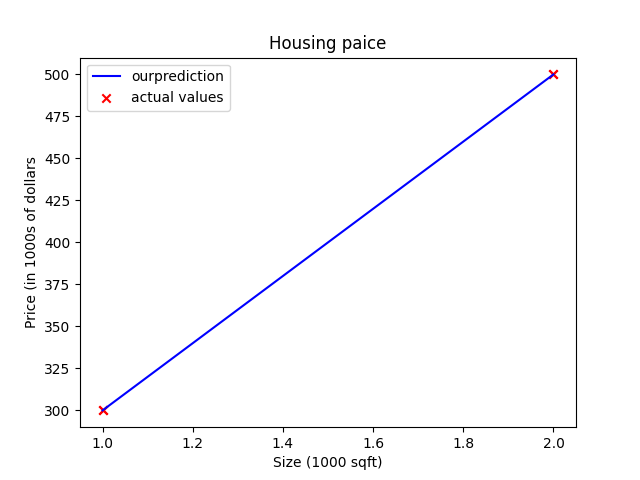

# Implement Linear Regression from scratch with Gradient Descent
A beginner-friendly implementation of Linear Regression using Python, NumPy, and Matplotlib.

## Features

- Load and visualize training data
- Implement the linear model:
  
  f(x) = wx + b

- Compute model predictions
- Implement the Cost Function (Mean Squared Error)
- Compute gradients
- Train the model using Gradient Descent
- Visualize the prediction line against the training data- 


## Technologies

- Python
- NumPy
- Matplotlib

## Project Structure

```
linear-regression-from-scratch/
│── linear_regression.py
│── Figure_1.png
└── README.md
```


## Output



## Learning Objectives

This project was created to understand the mathematical foundations of Linear Regression without using machine learning libraries such as Scikit-learn. It demonstrates how Gradient Descent optimizes the model parameters to minimize the prediction error.
